# Hi-Phy: A Benchmark for Hierarchical Physical Reasoning*
<p align="center">
Cheng Xue*, Vimukthini Pinto*, Chathura Gamage*, Peng Zhang, Jochen Renz<br>
School of Computing<br>
The Australian National University<br>
Canberra, Australia<br>
{cheng.xue, vimukthini.inguruwattage, chathura.gamage}@anu.edu.au<br>
{p.zhang, jochen.renz}@anu.edu.au
 </p>

Reasoning about the behaviour of physical objects is a key capability of agents operating in physical worlds. Humans are
very experienced in physical reasoning while it remains a major challenge for AI. To facilitate research addressing this
problem, several benchmarks have been proposed recently. However, these benchmarks do not enable us to measure an
agent's granular physical reasoning capabilities when solving a complex reasoning task. In this paper, we propose a new
benchmark for physical reasoning that allows us to test individual physical reasoning capabilities. Inspired by how
humans acquire these capabilities, we propose a general hierarchy of physical reasoning capabilities with increasing
complexity. Our benchmark tests capabilities according to this hierarchy through generated physical reasoning tasks in
the video game Angry Birds. This benchmark enables us to conduct a comprehensive agent evaluation by measuring the
agent's granular physical reasoning capabilities. We conduct an evaluation with human players, learning agents, and
heuristic agents and determine their capabilities. Our evaluation shows that learning agents, with good local
generalization ability, still struggle to learn the underlying physical reasoning capabilities and perform worse than
current state-of-the-art heuristic agents and humans. We believe that this benchmark will encourage researchers to
develop intelligent agents with advanced, human-like physical reasoning capabilities.

* equal contribution

---
#### Table of contents
1. [Hierarchy](#Hierarchy)
2. [Hi-Phy in Angry Birds](#Hi-Phy)
3. [Task Generator](#Task-generator)
    1. [Sub paragraph](#subparagraph1)
4. [Another paragraph](#paragraph2)
---


## 1.Hierarchy 
<a name="Hierarchy"/></a>
Humans and AI approaches learn much better when examples are presented in a meaningful order with increasing complexity
than when examples are presented randomly. We thereby propose a hierarchy for physical reasoning that enables an agent
to start with increasing complexity to facility training and evaluating agents to work in the real physical world.

Our hierarchy consists three levels and fifteen capabilities:

**Level 1: Understanding the instant effect of the first force applied to objects in an environment as a result of an
agent's action.**

    Level 1 capabilities:
    1.1: Understanding the instant effect of objects in an enviornment when an agent applys a single force.
    1.2: Unverstanding the instant effect of objects in an enviornment when an agent applys a multiple force.

**Level 2: Understanding objects movement in the environment after a force is applied.**

    Level 2 capabilities:
    2.1: Understanding that objects in the enviornment may roll.
    2.2: Understanding that objects in the enviornment may fall.
    2.3: Understanding that objects in the enviornment may slide.
    2.4: Understanding that objects in the enviornment may bounce.

**Level 3: Performing in tasks that require capabilities 1) human developed in infancy, 2) required in robotics to develop agents that
work alongside people, and 3) currently fall short in reinforcement learning.**

    Level 3 capabilities:
    3.1: Understanding relative weight of objects.
    3.2: Understanding relative height of objects.
    3.3: Understanding relative width of objects.
    3.4: Understanding shape difference of objects.
    3.5: Understanding how to preform non-greedy actions.
    3.6: Understanding structural weak points/stability.
    3.7: Understanding how to clear a path towards the goal.
    3.8: Understanding how to preform action with adequate timing.
    3.9: Understanding how to use tools.

Please refer to the paper for more details how and why we attributed the capabilities in this way.

## 2. Hi-Phy in Angry Birds
<a name="Hi-Phy"/></a>
Based on the proposed hierarchy, we develop Hi-Phy benchmark in Angry Birds. Hi-Phy contains tasks from 65 task templates belonging to the fifteen capabilities. Shown below are fifteen example tasks in Hi-Phy representing the fifteen capabilities.

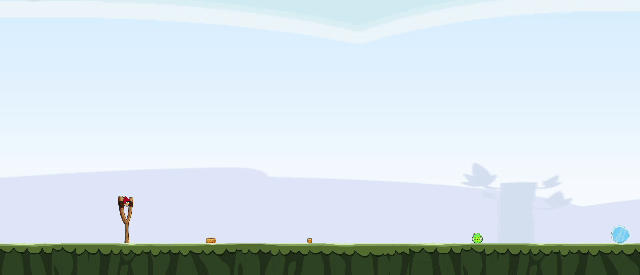 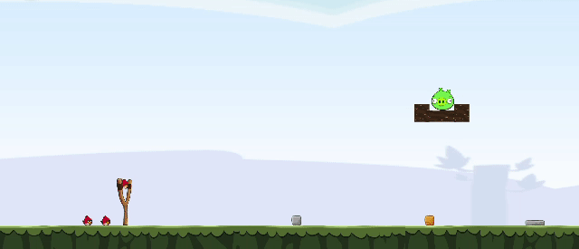 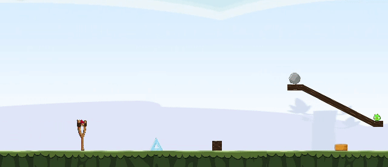 
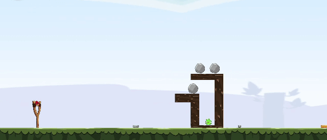 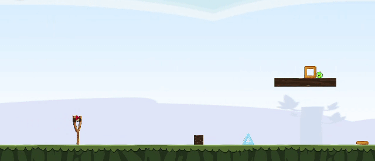 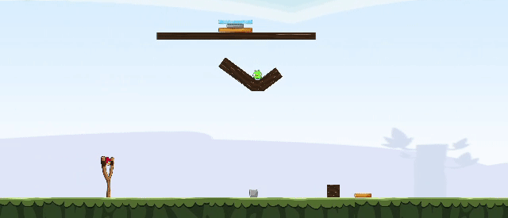 
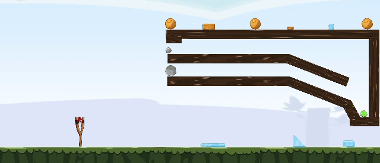 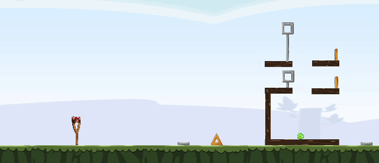 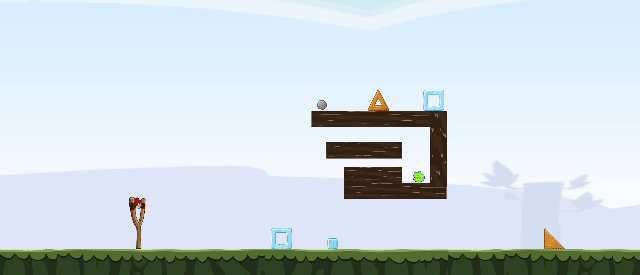 
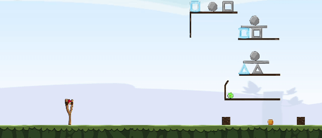 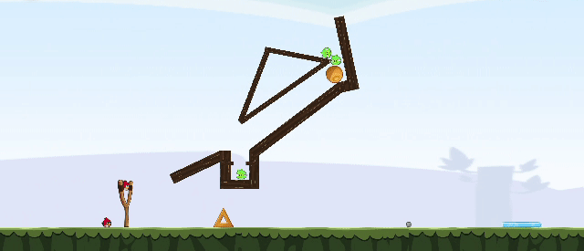 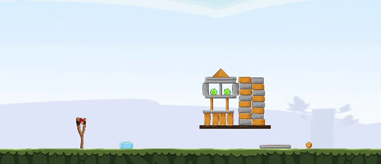 
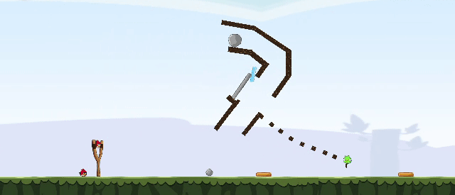 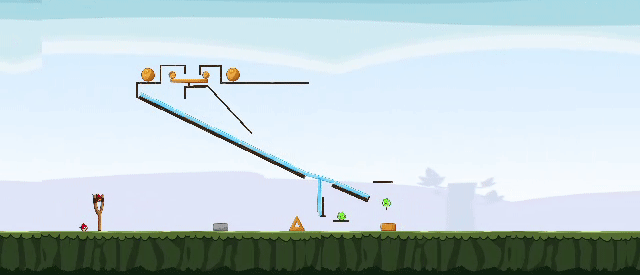 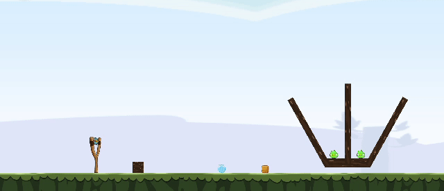 

## 3. Task generator
<a name="Task-generator"/></a>
We develop a task generator that can generate tasks for task templates we designed. The designed task templates can be found in 
To run the task generator:<br>
    1. Go to ```tasks/task_generator``` <br>
    2. Copy the task templates that you want to generate tasks into the ```task_generator\input``` folder (the level templates can be found in ```tasks/task_templates``` folder) <br>
    3. Run the tak generator<br>
     ```sh
        python tasks\generte_tasks.py
     ```
    4. Generated tasks will be available in ```tasks/task_generator/output```. <br>

## 4. levels created for baseline analysis - dataset structure , different capability
## 5. baseline agents - how to run baseline agents - science birds repo.
